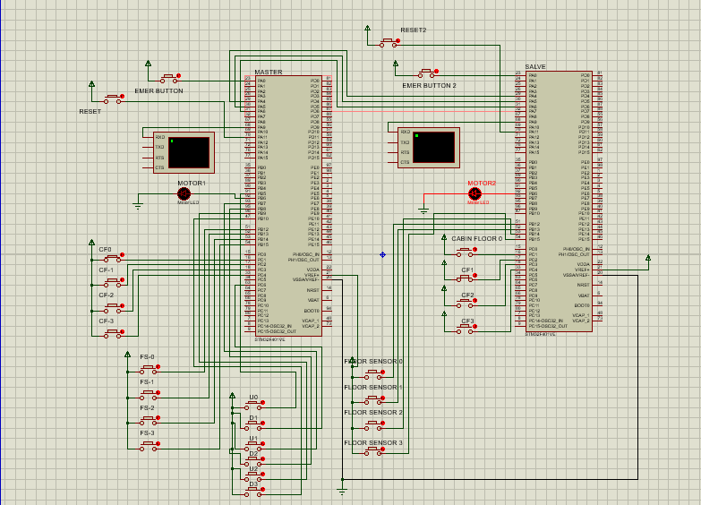
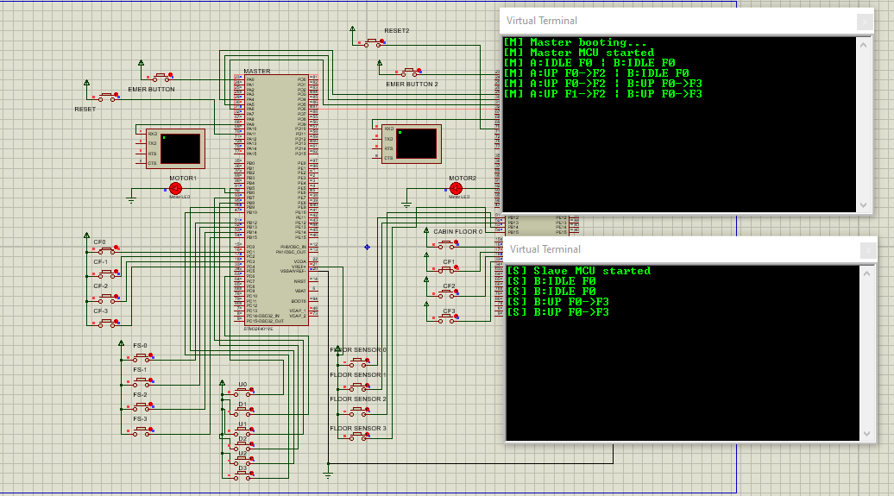

<div align="center">

# 🏗️ Collaborative Dual Elevator System

### Real-Time Inter-Processor Communication over SPI

<br>


---

*Two STM32 microcontrollers. One SPI bus. Pure interrupt-driven coordination.*

</div>

<br>

## 📖 Table of Contents

- [Concept](#-concept)
- [How It Works](#-how-it-works)
- [System Architecture](#-system-architecture)
- [Circuit Design](#-circuit-design)
- [Live Telemetry](#-live-telemetry)
- [Project Structure](#-project-structure)
- [Pin Mapping](#-pin-mapping)
- [Build & Flash](#-build--flash)
- [Tech Stack](#-tech-stack)

<br>

---

## 💡 Concept

Imagine two elevators in a building — they **don't** operate independently. Instead, they **collaborate** in real-time to serve passengers efficiently. When someone presses a hallway call button, a central **Dispatcher** algorithm scores both elevators and assigns the call to the **optimal** one — the one that's closest, already heading in the right direction, or simply idle.

This project brings that concept to life on bare-metal STM32 microcontrollers:

```
┌─────────────────────────────────────────────────────────┐
│                    BUILDING (4 Floors)                   │
│                                                         │
│   Floor 3  ──── [▼ Hall Btn] ────────────────────────   │
│   Floor 2  ──── [▲▼ Hall Btns] ─────────────────────   │
│   Floor 1  ──── [▲▼ Hall Btns] ─────────────────────   │
│   Floor 0  ──── [▲ Hall Btn] ────────────────────────   │
│                                                         │
│      ┌──────────┐   SPI Full-Duplex   ┌──────────┐     │
│      │ELEVATOR A│◄══════════════════►│ELEVATOR B│     │
│      │ (Master) │   50ms exchanges    │ (Slave)  │     │
│      │+Dispatch │                     │          │     │
│      └──────────┘                     └──────────┘     │
└─────────────────────────────────────────────────────────┘
```

> **The Master MCU** owns Elevator A and runs the Dispatcher. It decides which elevator serves each call.  
> **The Slave MCU** owns Elevator B. It receives assignments via SPI and reports its status back.

<br>
---

## 🔌 Circuit Design

> The full schematic built and simulated in **Proteus**

<p align="center">
  
</p>

<br>

---

## 📟 Live Telemetry

> Real-time UART output showing both elevators' states, floors, and movement targets

<p align="center">
  
</p>

**Telemetry format:**
```
[M] A:IDLE F0 | B:UP F1->F3         ← Master reporting both elevators
[S] B:UP F2->F3                      ← Slave reporting its own status
[M] A:DOWN F3->F1 | B:DOOR F3       ← Elevator A descending, B at doors
[M] A:IDLE F1 | B:IDLE F3 [FAULT]   ← Communication fault detected!
```

<br>

---

## ⚙️ How It Works

### 🔄 The IPC Protocol

Every **50ms**, a full-duplex SPI exchange occurs between Master and Slave:

| Direction | Frame (8 bytes) | Contents |
|-----------|----------------|----------|
| **Master → Slave** | `[HDR][CMD][TARGET][DIR][HALL_UP][HALL_DN][RSV][CHK]` | Commands: assign floor, emergency stop, status request |
| **Slave → Master** | `[HDR][STATE][FLOOR][TARGET][DIR][REQ_MASK][FLAGS][CHK]` | Status: current state, position, pending requests |

- **Header byte** `0xA5` for frame synchronization with auto-sync on desync
- **XOR checksum** validates every frame — corrupted data is discarded
- **Comm-fault detection** triggers after 4 consecutive failures (200ms timeout)
- **Graceful degradation** — if the link goes down, the Master absorbs all pending calls

### 🧠 The Dispatcher Algorithm

The Dispatcher uses a **scoring system** to pick the best elevator:

| Score | Meaning |
|-------|---------|
| `0` | **Immediate** — elevator is idle and already at the call floor |
| `1–9` | **Perfect match** — moving toward the call in the same direction |
| `50+` | **Idle fallback** — idle but needs to travel (distance-based) |
| `100+` | **Passed** — same direction but already passed the floor |
| `200` | **Opposite** — moving away, penalized heavily |
| `255` | **Unavailable** — in emergency or comm fault |

On a tie, the Dispatcher alternates between A and B to distribute load evenly.

### 🚦 The Elevator State Machine

Each elevator runs a deterministic **Mealy FSM** driven by a 50ms hardware timer:

```
                  ┌──────────────┐
        ┌────────►│   IDLE       │◄────────┐
        │         │  Motor: OFF  │         │
        │         └──────┬───────┘         │
        │                │ request         │
        │           ┌────┴────┐            │
        │           ▼         ▼            │
   ┌────┴─────┐  ┌──────────────┐   ┌─────┴────┐
   │MOVING UP │  │ DOORS OPEN   │   │MOVING DN │
   │Motor:100%│  │ Motor: OFF   │   │Motor:100%│
   │Slow: 20% │  │ 150ms timer  │   │Slow: 20% │
   └────┬─────┘  └──────────────┘   └─────┬────┘
        │                                  │
        │         ┌──────────────┐         │
        └────────►│  EMERGENCY   │◄────────┘
                  │  Motor: OFF  │
                  │  All stopped │
                  └──────────────┘
```

- **Floor transit**: 5 ticks × 50ms = **250ms** per floor
- **Door open time**: 3 ticks × 50ms = **150ms**
- **Motor deceleration**: Slows to 20% duty when approaching target floor

<br>

---

## 🏛️ System Architecture

```
┌──────────────── MASTER MCU (STM32F401) ─────────────────┐
│                                                          │
│  ┌──────────┐  ┌────────────┐  ┌──────────────────────┐ │
│  │   EXTI   │  │   State    │  │    Dispatcher        │ │
│  │ Callbacks│─►│  Machine A │  │ (Scoring Algorithm)  │ │
│  │ (Buttons │  │  (Mealy)   │  │                      │ │
│  │ +Sensors)│  └────────────┘  └──────────┬───────────┘ │
│  └──────────┘                             │             │
│                                    assign │             │
│  ┌──────────┐  ┌────────────┐     to B?   │             │
│  │  TIM2    │  │   UART1    │◄────────────┘             │
│  │ 100ms    │─►│  Telemetry │                           │
│  │Telemetry │  │  (DMA TX)  │                           │
│  └──────────┘  └────────────┘                           │
│                                                          │
│  ┌──────────┐  ┌────────────┐                           │
│  │  TIM3    │  │   SPI1     │ ◄─── Full Duplex ────►   │
│  │  50ms    │─►│  Master    │         IPC Link          │
│  │IPC Timer │  │  Exchange  │                           │
│  └──────────┘  └────────────┘                           │
│                                                          │
│  ┌──────────┐  ┌────────────┐                           │
│  │  TIM5    │  │   TIM4     │                           │
│  │  50ms    │  │   PWM      │                           │
│  │Floor Tick│  │  Motor LED │                           │
│  └──────────┘  └────────────┘                           │
└──────────────────────────────────────────────────────────┘
                        ║ SPI1 (PA4-PA7)
                        ║ 62.5 kHz clock
                        ║ 8-byte frames
                        ▼
┌──────────────── SLAVE MCU (STM32F401) ──────────────────┐
│                                                          │
│  ┌──────────┐  ┌────────────┐  ┌──────────────────────┐ │
│  │   EXTI   │  │   State    │  │   SPI1 Slave         │ │
│  │ Callbacks│─►│  Machine B │◄─┤  (IRQ-driven RX)     │ │
│  │          │  │  (Mealy)   │  │  Double-buffered TX   │ │
│  └──────────┘  └────────────┘  └──────────────────────┘ │
│                                                          │
│  ┌──────────┐  ┌────────────┐  ┌──────────────────────┐ │
│  │  TIM5    │  │  TIM4 PWM  │  │  UART1 Telemetry     │ │
│  │Floor Tick│  │  Motor LED │  │  (DMA TX)             │ │
│  └──────────┘  └────────────┘  └──────────────────────┘ │
└──────────────────────────────────────────────────────────┘
```
<br>
---

## 📂 Project Structure

```
📦 DualElevator/
├── 📂 main/
│   ├── main_master.c          # Master entry — Elevator A + Dispatcher + IPC
│   └── main_slave.c           # Slave entry — Elevator B + IPC responder
│
├── 📂 state_machine/
│   └── State_Machine.c/.h     # Elevator FSM (Idle/Up/Down/Door/Emergency)
│
├── 📂 Dispatcher/
│   └── Dispatcher.c/.h        # Hall-call scoring & assignment algorithm
│
├── 📂 Ipc/
│   └── Ipc.c/.h               # SPI protocol: framing, checksum, fault detection
│
├── 📂 Spi/
│   └── Spi.c/.h               # Register-level SPI1 driver (Master + Slave)
│
├── 📂 Config/
│   └── Board_Config.h         # Central pin-map, timer assignments, build roles
│
├── 📂 Gpio/                   # GPIO driver (Init, Read, Write, AF)
├── 📂 Rcc/                    # Clock enable driver
├── 📂 Timer/                  # General-purpose timer driver
├── 📂 Pwm/                    # PWM output driver (motor LED simulation)
├── 📂 Uart/                   # USART1 driver (9600 baud)
├── 📂 Dma/                    # DMA2 Stream7 for non-blocking UART TX
├── 📂 Exti/                   # External interrupt driver
├── 📂 nvic/                   # NVIC priority & enable driver
├── 📂 Common/                 # Std_Types.h, Bit_Math.h
│
├── 📄 CMakeLists.txt          # Dual-target build (Master.elf + Slave.elf)
├── 📄 STM32F401xE.ld/.s       # Linker script & startup assembly
├── 📄 FinalProjectEm.pdsprj   # Proteus simulation project
└── 📄 README.md
```

<br>

---

## 📌 Pin Mapping

### Shared Pins (Both MCUs)

| Function | Port/Pin | Peripheral | Notes |
|----------|----------|------------|-------|
| SPI NSS | PA4 | SPI1 | Master: GPIO output, Slave: HW NSS |
| SPI SCK | PA5 | SPI1 (AF5) | 62.5 kHz clock (fPCLK/256) |
| SPI MISO | PA6 | SPI1 (AF5) | |
| SPI MOSI | PA7 | SPI1 (AF5) | |
| UART TX | PA9 | USART1 | 9600 baud telemetry |
| UART RX | PA10 | USART1 | |
| Emergency Stop | PA0 | EXTI0 | Priority 0 (highest) |
| Reset Button | PA11 | EXTI11 | Clears emergency state |
| Cabin Btn F0–F3 | PC1–PC4 | EXTI1–4 | Internal floor requests |
| Floor Sensor F0–F3 | PB12–PB15 | EXTI12–15 | Position feedback |
| Motor LED | PB6 | TIM4_CH1 (AF2) | PWM: 0% / 20% / 100% |

### Master-Only Pins (Hallway Buttons)

| Button | Port/Pin | Call |
|--------|----------|------|
| Hall Up @ F0 | PB5 | ▲ Floor 0 |
| Hall Down @ F1 | PC6 | ▼ Floor 1 |
| Hall Up @ F1 | PB7 | ▲ Floor 1 |
| Hall Down @ F2 | PB8 | ▼ Floor 2 |
| Hall Up @ F2 | PB9 | ▲ Floor 2 |
| Hall Down @ F3 | PB10 | ▼ Floor 3 |

<br>

---

## 🔨 Build & Flash

### Prerequisites

- `arm-none-eabi-gcc` toolchain
- CMake ≥ 3.10
- Ninja build system
- Proteus 8+ (for simulation)

### Build Commands

```bash
# Configure
cmake --preset default

# Build both targets
cmake --build build

# Output:
#   build/Master.hex  →  Flash into Master MCU in Proteus
#   build/Slave.hex   →  Flash into Slave MCU in Proteus
```

The build system automatically produces **two separate firmware images** from the same codebase using compile-time defines:

| Target | Define | Role |
|--------|--------|------|
| `Master.elf` | `-DBOARD_ROLE_MASTER=1` | Elevator A + Dispatcher + SPI Master |
| `Slave.elf` | `-DBOARD_ROLE_SLAVE=1` | Elevator B + SPI Slave |

<br>

---

## 🛠️ Tech Stack

| Layer | Technology |
|-------|------------|
| **MCU** | STM32F401xE (ARM Cortex-M4, 16 MHz) |
| **Language** | C11, bare-metal (no HAL, no RTOS) |
| **Communication** | SPI1 Full-Duplex @ 62.5 kHz |
| **Telemetry** | USART1 @ 9600 baud (DMA2 optional) |
| **Motor Control** | TIM4 PWM (variable duty cycle) |
| **Interrupts** | EXTI (buttons/sensors), TIM (scheduling), SPI (slave RX) |
| **Build System** | CMake + Ninja + arm-none-eabi-gcc |
| **Simulation** | Proteus 8 |
| **Architecture** | Interrupt-driven, zero-polling, WFI sleep in main loop |

<br>

---

<div align="center">

### ⚡ Built with register-level C — no HAL, no RTOS, just pure embedded engineering.

</div>
